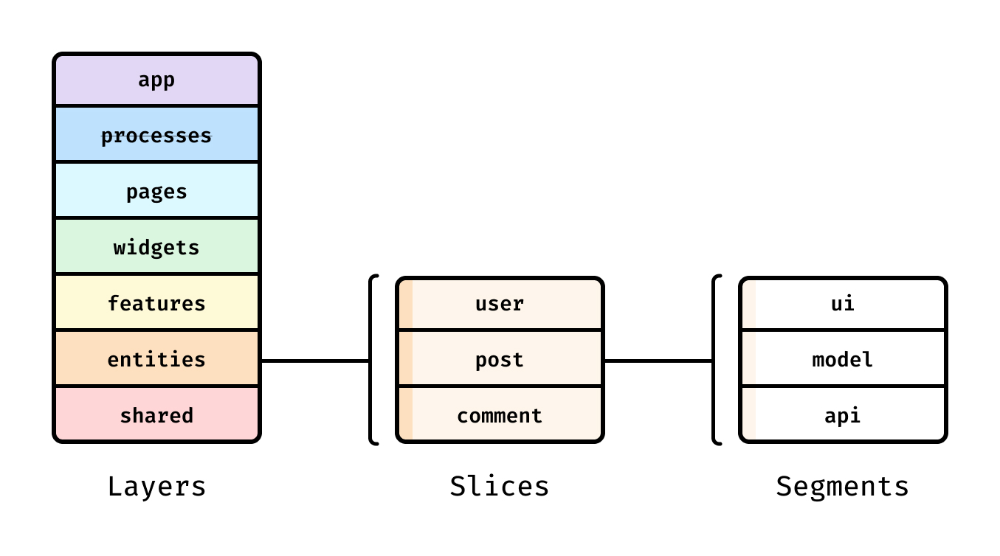

# HR Платформа

## Стэк

- [Next.js SSR](https://nextjs.org);
- [React](https://react.dev/);
- [TypeScript](https://typescriptlang.org/);
- [Ant Design](https://ant.design);
- [SCSS](https://sass-lang.com/);
- [Yarn 1.22](https://yarnpkg.com/);
- [NodeJS](https://nodejs.org/en);
- [ESLint](https://eslint.org/);
- [Prettier](https://prettier.io/);
- [FSD](https://feature-sliced.design/ru/docs);

## Обязательно:

- `node -v 20` и не ниже;
- `yarn -v` версии `1.22` (версии выше первой не нужны);

## Запуск:

- `yarn dev`;
- Открой браузер по адресу [localhost:3000](http://localhost:3000);

## Философия:

Всю статику (картинки, шрифты, фавиконки) - держим в public/`segment`, где `segment` это слой (images/fonts итп);

Мы используем `Feature-sliced Design` — "Нарезанный на фичи дизайн", что предполагает наличие бизнес-сущностей независимо
от обёрток или различного рода контейнеров. Такая методология позволяет отлично разделять презентационные компоненты от
компонентов, которые предоставляют какой-то бизнес функционал или отображение бизнес-сущности.

- `_app` — настройки, стили и провайдеры для всего приложения.
- `pages (страницы)` — композиционный слой для сборки полноценных страниц из сущностей, фич и виджетов.
- `widgets (виджеты)` — композиционный слой для соединения сущностей и фич в самостоятельные блоки. (например,
  IssuesList, UserProfile).
- `features (фичи)` — взаимодействия с пользователем, действия, которые несут бизнес-ценность для пользователя. (
  например, SendComment, AddToCart, UsersSearch).
- `entities (сущности)` — бизнес-сущности. (например, User, Product, Order).
- `shared` — переиспользуемый код, не имеющий отношения к специфике приложения/бизнеса. (например, UIKit, libs, API).

В итоге вложенность может быть строго такая (где может не быть, например, виджета, этот слой можно пропустить итп):
`shared -> entity -> feature -> widget -> page`;

Затем есть слайсы, разделяющие код по предметной области. Они группируют логически связанные модули, что облегчает
навигацию по кодовой базе. Слайсы не могут использовать другие слайсы на том же слое, что обеспечивает высокий уровень
связности (`cohesion`) при низком уровне зацепления (`coupling`).

В свою очередь, каждый слайс состоит из сегментов. Это маленькие модули, главная задача которых — разделить код внутри
слайса по техническому назначению. Самые распространенные сегменты — ui, model (store, actions), api и lib (
utils/hooks), но в вашем слайсе может не быть каких-то сегментов, могут быть другие, по вашему усмотрению.